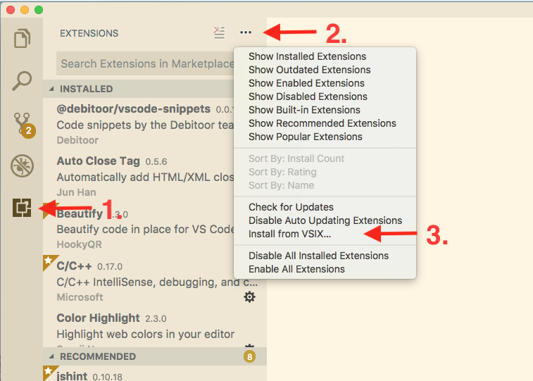

# debitoor-vscode-snippets README

VsCode snippets.

## Installing

1. Clone repo

1. Run the build command

 ```bash
> npm run build
 ```

3. In your vscode editor go to the extension library. Press the three dots and select `Install from VSIX` and select the `.vsix` file that you just generated



## Requirements

- All snippets should be placed in `/parts/{language}/`.
- All files should start with a `_` and be of the type `.json` eg `_ruby.json`

A `{language}.json` file will be placed in `snippets/{language}.json`

### Combining files

To generate your javascript snippets simple run

```bash
> npm run merge javascript
> npm run merge lib-where-files-is-placed
```

## Contribute

Feel that something is missing? Feel free to contribute.

Just place a pull request with your changes
